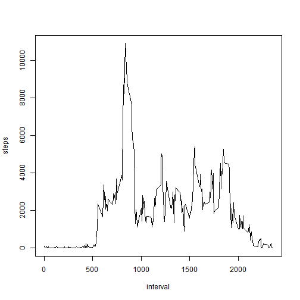

Reproducible Research: Peer Assessment 1
========================================

Loading the data and preprocessing the data:

Here I load the data and remove rows with 'NA' values.


```r
activity <- read.csv("~/workingdirectory/repdata_data_activity/activity.csv")

tidydata <- subset(activity, complete.cases(activity))
```


Calculate and report the mean and median total number of steps taken per day

First I aggregate the total steps taken for each day, then I compute the mean and median:


```r
steps_per_day <- aggregate(steps ~ date, tidydata, sum)
mean(steps_per_day$steps)
```

```
## [1] 10766
```

```r
median(steps_per_day$steps)
```

```
## [1] 10765
```


Make a histogram of the total number of steps taken each day


```r
hist(steps_per_day$steps, col = "green")
```

 


What is the average daily activity pattern?

First I aggregate total steps over each interval, then make the time series plot.

```r
steps_per_interval <- aggregate(steps ~ interval, tidydata, sum)
plot(steps ~ interval, steps_per_interval, type = "l")
```

 


Which 5-minute interval, on average across all the days in the dataset, contains the maximum number of steps?

```r
steps_per_interval$interval[which.max(steps_per_interval$steps)]
```

```
## [1] 835
```


Calculate and report the total number of missing values in the dataset (i.e. the total number of rows with NAs)


```r
sum(is.na(activity))
```

```
## [1] 2304
```


I will substitute the step means for the 5 minute intervals for missing values in those intervals.

```r
new_activity <- merge(activity, steps_per_interval, by = "interval")
replace <- is.na(new_activity$steps.x)
new_activity$steps.x[replace] <- new_activity$steps.y[replace]
new_activity <- new_activity[, c(1:3)]
names(new_activity) <- c("interval", "steps", "date")
```


Recalculating the histogram, mean, and median with the imputed dataset


```r
steps_per_day <- aggregate(steps ~ date, new_activity, sum)
mean(steps_per_day$steps)
```

```
## [1] 84188
```

```r
median(steps_per_day$steps)
```

```
## [1] 11458
```

```r
hist(steps_per_day$steps, col = "green", breaks = 2)
```

 


What is the impact of imputing missing data on the estimates of the total daily number of steps?

The impact is noticle on the mean but not the median.

Are there differences in activity patterns between weekdays and weekends?


```r

typeofday <- function(date) {
    if (weekdays(as.Date(date)) %in% c("Saturday", "Sunday")) {
        "weekend"
    } else {
        "weekday"
    }
}

new_activity$typeofday <- as.factor(sapply(new_activity$date, typeofday))
```


Make a panel plot containing a time series plot (i.e. type = "l") of the 5-minute interval (x-axis) and the average number of steps taken, averaged across all weekday days or weekend days (y-axis).


```r

par(mfrow = c(2, 1))

weekend <- aggregate(steps ~ interval, data = new_activity, subset = typeofday == 
    "weekend", FUN = mean)
plot(weekend, type = "l", main = "weekend")

weekday <- aggregate(steps ~ interval, data = new_activity, subset = typeofday == 
    "weekday", FUN = mean)
plot(weekday, type = "l", main = "weekday")
```

 


It appears that on weekdays, there is a burst of walking activity in the morning, whereas on weekends walking is distributed more evenly.
